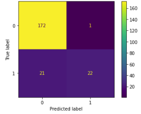

```{r setup, include=FALSE}
knitr::opts_chunk$set(echo = TRUE)
```

```{r getdata, include = FALSE}
library(dplyr) 
library(data.table)
library(tidyr)
library(ggplot2) 
library(stringr)
library(knitr)
library(clipr) 
library(edgeR)  # NOTE: Must capitalize R lolololol
library(tibble)
library(magrittr)
library(tibble)

load("her2.RData") # get this loaded in the .rmd environment cuz it's messy otherwise lol
```

### *"Go not to the Elves for counsel, for they will say both no and yes."*
*-- Frodo Baggins*

Hi! I'll summarize just below what I've done here, and then tell the story of my efforts to make sense of these data. 

The code, and the Kaggle notebook I'll make mention of later, are both here: <https://github.com/patimus-prime/rnaseq_her2>. I wrote this in a pretty relaxed tone given this was a coding challenge. My Master's thesis is available at my Github for an example of more working-level writing.

## Summary/Abstract

RNASeq data were imported to R, cleaned/wrangled and matched with data from clinic. After normalizing the data via edgeR's TMM, clustering via PCA does not provide meaningful classification for any patient groups. Density graphs for gene counts/expression, and a logistic model based on these expression levels and some clinical data, suggest patient RNASeq data has limited application for diagnosis. Overall, the data suggest a supplementary role for RNASeq in HER2 cancer diagnosis; and at that, a role limited to confirming negative results, or potentially challenging positive results.

## Great beginnings

I began with making the decision to treat the RSEM data as, effectively, raw counts requiring being rounded up. I had to double check, a few papers made mention that in the process of producing the estimated counts via RSEM, there is some level of normalization. I'm not sure if it's only to account for transcript/gene lengths; but that all felt out of the scope for this challenge, so, raw counts! In hindsight I am suspicious this affected the results and plots I saw.

From the RSEM .csv, I isolated the RNA data and matched each patients' RNA data to their IHC results from the clinical data. I did not end up including FISH results in my analysis. I filtered to only get one library, primary tumor data for each patient. 

I used edgeR for many of the following steps. 

These libraries were then filtered to exclude genes that did not have at least 1 read (rounded up) per million (cpm). I input the data into a DEGList object and used edgeR's normalization algorithm (uses TMM). These normalized counts I eventually used to implement a logistic regression model.

## Clustering and Variance Plots

I clustered the data based on the top 500 most differentially expressed genes. edgeR uses log2 to transform the data and uses PCA in this case. It was a decent effort to QC the data and get to this point, so I was rather deflated to see:
```{r d_mds, echo = FALSE}
#load("her2.RData")
d_mdsplot
```

Almost everything is jumbled up together! The impostor syndrome hit me, I questioned all my life decisions leading up to the moment I made this plot. I told my mom this challenge might be more than I'd anticipated and she told me about how easy it is to become a real estate agent.


In desperation, exasperation, I used the exact Test function and *tried* to output the most differentially expressed genes and...
```{r d10, echo = FALSE}
topTags(et, n = 10)
```

HER2/ERBB2 doesn't even show up! What!?

Actually the answer is right there, but I was perplexed for a hot minute: exact test had compared the indeterminate and equivocal groups. I had to go back and specify the data for patients who had tested positive or negative via IHC. 

I did the exact test again, this time specifying data from patients who'd tested positive or negative. And:
```{r io_exactT, echo = FALSE}
topTags(et2, n = 10)
```

AHA!!! THERE IT IS!!! I don't have to return my degrees! I took a quick look at the differential gene expression smear plot:
```{r d_dge, echo = FALSE}
plotSmear(et2, de.tags=detags)
```

Ok! Now we're getting somewhere. It's not super informative and I knew what I was looking for, but there's some outliers there to examine. Or rather, the output above is confirmed and we do have some very altered gene expression.

I was hopeful! I created a new DEGList object to redo the clustering, this time only including data from positive/negative patients, hoping maybe those equivocal/intermediate groups had had sole responsibility for throwing off calculations. And...
```{r ioclustering, echo = FALSE}
io_cluster
```

NOT what I was hoping for. On the periphery there is perhaps some separation, but at least upon visual analysis these few data are not representative of really meaningful clustering and clear, populous groups. edgeR has poor capability to examine which components explain the most variance; but it does give a percentage for the top two components that create the graph. It wasn't informative, so I moved onto the next analysis.

## Density Plots

After this I wanted to confirm that HER2 expression was actually meaningfully different between positive/negative groups. Up until now I'd been working under that expectation, including all reasonably expressed genes and hoping to see the differing expression provide easy classification.

I made a density plot of the expression levels for each group. And behold!
```{r density_her2_io, echo = FALSE}
io_densityher2
```

There's that scene in Home Alone 2 where the concierge finds out the credit card is stolen and the light comes on, shining upon his Grinch-like, diabolical smile; that's what seeing this plot was for me. It forms the basis for the remainder of this analysis. 

The expression levels are such that one can easily determine the negative group, how exciting! This suggested that one could use some cutoff of the normalized count to provide some supplemental test for positivity. But, a considerable amount of positive-testing patients fall into the expression levels of most negative patients. This may suggest IHC false-positives; an examination of FISH results against these data may provide some clarity. I didn't include FISH data in my analysis, mostly because there were a lot of patients the data wasn't collected for and so it'd reduce what I could include in the model (and to save time). So I couldn't test this false-positive hypothesis.

However appealing the above graph was, it only includes the positive/negative groups and therefore may not be representative of the overall ability for the RNA data to classify groups. So, I made the plot again and included all IHC groups:
```{r density_her2_d, echo = FALSE}
 density_d
```

And almost back to square one. There is still a cutoff above which one can be fairly certain to mostly see positive patients, but it is much noisier than the prior graph. I looked at the next four most differentially expressed genes:

```{r other_densities, echo = FALSE}
density1
density2
density3
density4
```

Similar result: there is some cutoff where one can suspect a positive IHC but not equivocally. 

At this point I thought I'd start wrapping up, but the density plots suggested maybe if I only looked at the most differentially expressed genes (I used these 5), maybe I'd see better clustering. A highly biased approach, but maybe it could be informative. I also only used the positive/negative group; effectively, the best case scenario for seeing meaningful clustering:
```{r top5cluster, echo = FALSE}
io_top5_cluster
```

... And still for the vast majority of patients, no good clustering and therefore their RNA data cannot provide an alternative means of diagnosis, at least given what I've seen in this analysis. The density curves suggest a supplementary role, where below some cutoff one is almost certainly negative. 

This was the last visualization I made with the RNA data prior to constructing a logistic regression model.

## Logistic Regression Model

I included the following features in my model: the counts of the top 5 differentially expressed genes I examined above, age, and fraction genome altered. (I wanted to include sex and race/ethnicity data but for too many patients it was missing, and the vast majority of patients were women.) I also tried to include the erbb2 count data; but when I did, the precision was a flat 1, and I was suspicous the model was cheating, so these data were ultimately completely excluded from my analysis.

I used those features to predict IHC status. I built the model using Python/scikitlearn on Kaggle; by the time I finished the above analysis my linux partition had, and still has, frighteningly little space left. It's accessible here: <https://github.com/patimus-prime/rnaseq_her2/blob/main/her2-logistic-regression.ipynb>

Overall, the model did a great job classifying... patients that were negative. The metrics provided by scikit learn are:

- accuracy score: 0.8981481481481481
- precision score: 0.9565217391304348
- recall score: 0.5116279069767442

I was pretty excited until I saw the recall score; the confusion matrix helps explain:
```{r confusion, echo=FALSE,out.width="50%",fig.cap="Confusion Matrix for Logistic Regression Model",fig.show="hold",fig.align='center'}

```

When classifying patients as negative, the model is almost perfect. But for patients who are positive, the model runs into the same issues as a human looking at the density graphs: the data are just too noisy. Or, to put the hypothesis out there again, the IHC results actually do a poor job differentiating positive patients.

## Conclusion

The above analysis I tried not to go overboard with, so it's not as thorough as one could be outside a coding challenge. I hope to have demonstrated an aptitude for coding in R and Python, as well as some ability in analyzing RNASeq data.

Basically copying the summary above: After normalizing the data, clustering via PCA does not provide meaningful classification for any patient groups. Density graphs for gene counts/expression, and a logistic model based on these expression levels and some clinical data, all suggest that RNASeq data has limited application for diagnosis. Overall, the data suggest a supplementary role for RNASeq in HER2 cancer diagnosis; and at that, a role limited to confirming negative results, or potentially challenging positive results.